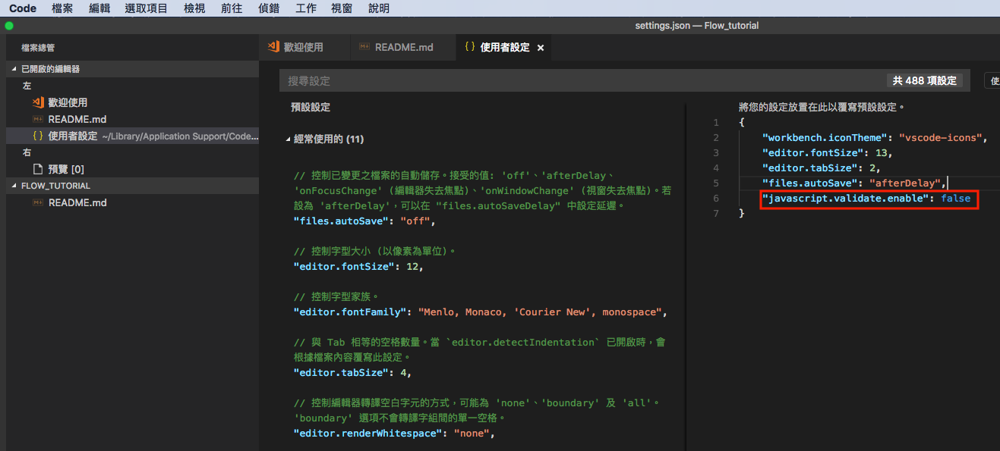

# Flow教學
- Flow可以在程式碼運行前對類型錯誤進行檢查，包括：
  - 類型錯誤
  - 對null 的引用
  - 以及可怕的“undefined is not a function” flow允許我們給變量添加類型
    - boolean、number、string、null、void

# Usage
1. clone the repository
```
$ git clone https://github.com/andy6804tw/Flow_tutorial.git
```
2. install package
```
$ npm install
$ cd Flow_tutorial
```

## 教學
1. 修改VS Code設定檔
> 由於VS Code本身就帶有JavaScript與TypeScript檢查的功能，會與Flow相衝到所以我們要關閉VS Code的檢查功能，在使用者設定中(喜好設定->設定)，加上下面這行設定值以免衝突
```js
"javascript.validate.enable": false
```

  
2. 安裝Flow
```
$ npm install --save-dev flow-bin  
  或
$ npm install --global flow-bin
```
3. 初始化專案將會建立一個.flowconfig檔案
```
$ flow init
```
4. 在程式碼檔案中加入要作類型檢查的註解
```
// @flow
   或
/* @flow */
```
3. 若您的編譯環境無安裝Flow外掛套件可輸入以下命令進行檢查
```
$ flow check
```
4. 轉換(編譯)有Flow標記的程式碼
> 在開發的最後階段要將原本有使用Flow標記，或是有類型註釋的程式碼，進行清除或轉換。
使用babel編輯器如果以命令列工具為主，可以使用下面的指令來安裝在全域中:
```
$ npm install -g babel-cli
```
5. 加裝額外移除Flow標記的npm套件在你的專案中
```
$ npm install --save-dev babel-plugin-transform-flow-strip-types
```
6. 建立一個 .babelrc 的設定檔，內容如下
```js
{
  "plugins": [
    "transform-flow-strip-types"
  ]
}
```
7. 打包輸出移除Flow標記
> 完成設定後，之後babel在編譯時就會一併轉換Flow標記。下面的指令是把src目錄的檔案編譯到dist目錄中
```
$ babel src -d dist
```
> 筆者開發環境是使用VScode記得安裝 Flow Language Support的擴充套件才會即時顯示錯誤哦

## MIT License
```
Copyright (c) 2017 Yi Lin Tsai 

Permission is hereby granted, free of charge, to any person obtaining a copy
of this software and associated documentation files (the "Software"), to deal
in the Software without restriction, including without limitation the rights
to use, copy, modify, merge, publish, distribute, sublicense, and/or sell
copies of the Software, and to permit persons to whom the Software is
furnished to do so, subject to the following conditions:

The above copyright notice and this permission notice shall be included in all
copies or substantial portions of the Software.

THE SOFTWARE IS PROVIDED "AS IS", WITHOUT WARRANTY OF ANY KIND, EXPRESS OR
IMPLIED, INCLUDING BUT NOT LIMITED TO THE WARRANTIES OF MERCHANTABILITY,
FITNESS FOR A PARTICULAR PURPOSE AND NONINFRINGEMENT. IN NO EVENT SHALL THE
AUTHORS OR COPYRIGHT HOLDERS BE LIABLE FOR ANY CLAIM, DAMAGES OR OTHER
LIABILITY, WHETHER IN AN ACTION OF CONTRACT, TORT OR OTHERWISE, ARISING FROM,
OUT OF OR IN CONNECTION WITH THE SOFTWARE OR THE USE OR OTHER DEALINGS IN THE
SOFTWARE.
```

